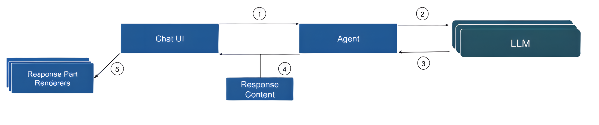
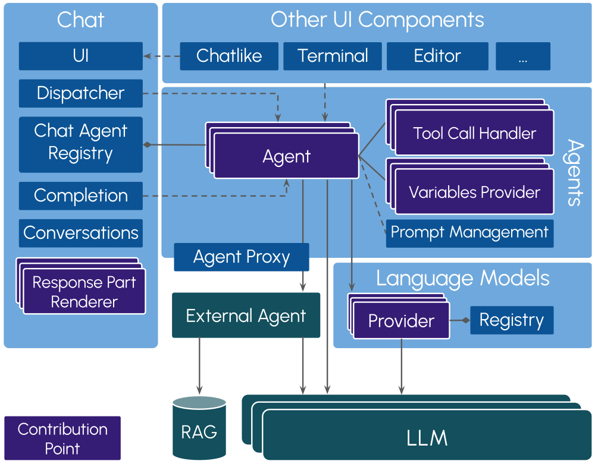
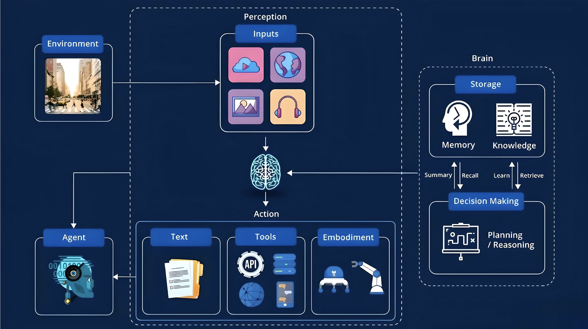
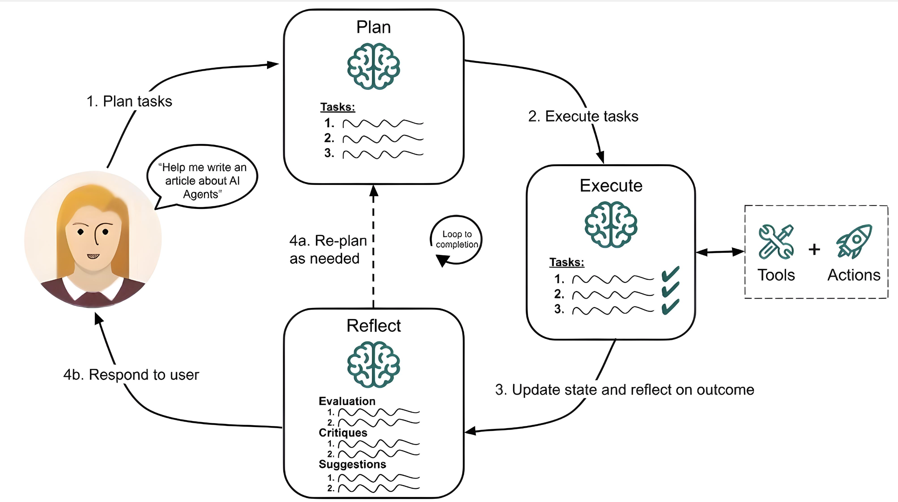
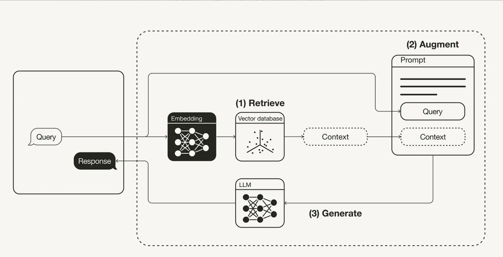
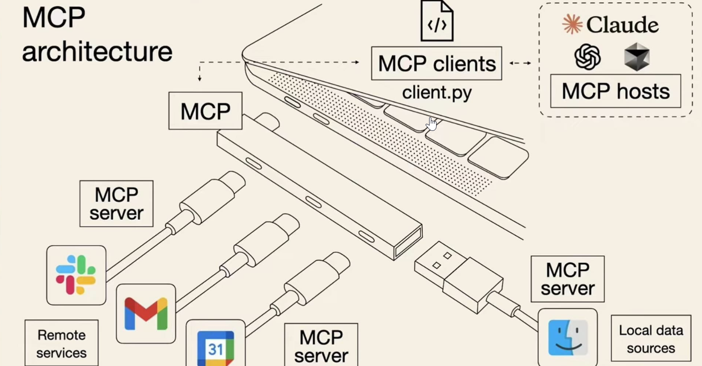
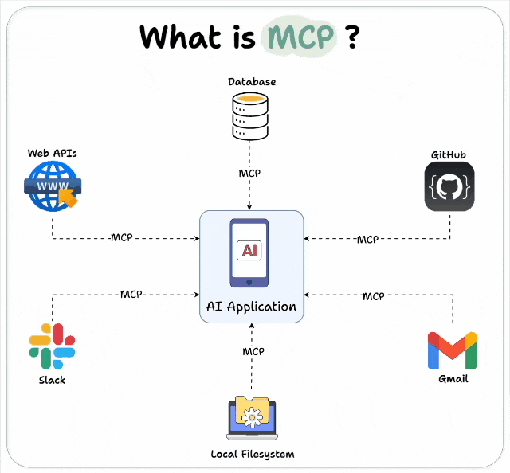

## AI-Features

## Agent

- 定义系统提示模板，设置代理的行为。(它是指导代理如何与 LLM 交互的基础)

- 创建聊天代理，自定义代理行为，指定其语言模型要求、使用的提示模板，并定义其与用户的交互。

- 开发代理的行为，包括一个或多个可靠地返回预期输出的提示

### 变量和工具函数

  > 代理通常需要与工具交互以获取动态数据，例如文本选择、项目数据或任何特定于工具的数据。您可以将这些实际数据封装在变量中，然后可以在提示词或用户请求中使用，并在运行时使用工具中的实际数据进行解析。
  >
  > 此外，代理还可以使用工具函数，允许底层 LLM 主动调用操作，以检索更多信息或触发任何类型的操作，包括修改数据。

#### 变量（Variables）

默认支持两种类型的变量：全局变量和代理变量。二者的主要区别在于变量否全局通用。

- **全局变量**：指的是任何代理都可以使用的变量。

  工具开发者可以轻松注册自己的全局变量，以提供来自工具状态的任意额外数据，包括他们的自定义工具组件。全局变量可以在任何提示模板中使用，可以在默认的聊天界面使用。

- **代理变量**：指的是只对特定的 AI 代理可用的变量。

​	代理变量只能在特定代理的提示模板中使用，其他代理无法访问这些变量，在默认的聊天界面中也不可用。

这种设计允许：

- 工具开发者扩展系统功能，添加新的全局变量

- 为特定代理创建专用的变量，实现更精细的控制

- 在默认聊天界面中提供基本的变量访问能力

- 通过变量系统实现工具状态和 AI 代理之间的数据共享

#### 工具函数（Tool Functions）

## RAG

## MCP

