## view contribution


如果你希望注册的View视图，将其加入到Shell中展示出来。那么你可以按照如下那么做：
- 实现一个自己的View Contribution，让其继承自AbstractView：在构造函数中传入View配置，告诉Shell加入你的Widget，并放在什么位置等信息。
  
  ```ts
  export class GettingStartedViewContribution extends AbstractView<GettingStartedWidget> {
    constructor({
        widgetId: GettingStartedWidget.ID,
        widgetName: GettingStartedWidget.LABEL,
        defaultWidgetOptions: {
          area: "main",
        },
      })
  }
  ```
  
- 让App知道它是一个View Contribution：添加@Contribution(IView)装饰器。
  
  ```ts
  @Contribution(IView)
  export class GettingStartedViewContribution extends AbstractView<GettingStartedWidget> {}
  ```
  
- 实现IView接口：在Shell初始化的时候调用this.setupView注册视图。

  ```ts
  @Contribution(IView)
  export class GettingStartedViewContribution extends AbstractView<GettingStartedWidget> implements IView {
    async onShellLayoutInit(): Promise<void> {
      await this.setupView({ reveal: true, activate: true });
    }
  }
  ```