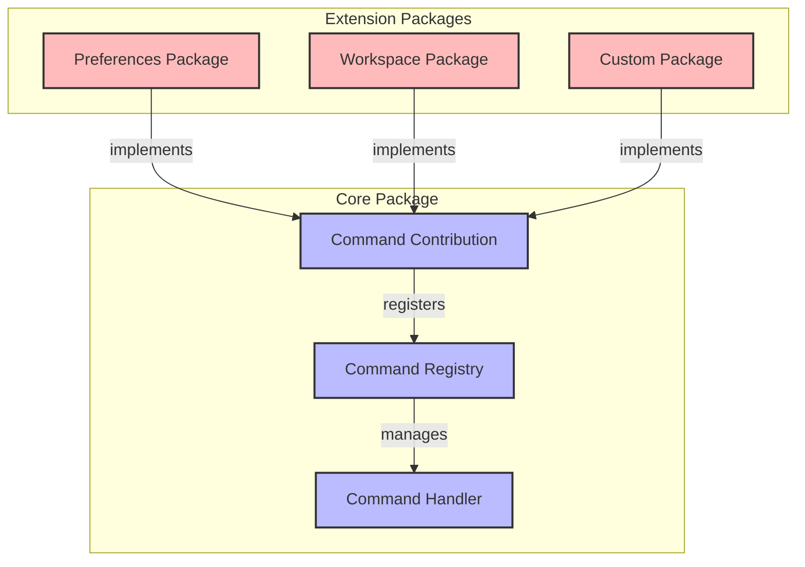

## Command System（命令系统）

如果一段执行逻辑有可能通过不同的交互方式触发，那么设计命令系统就能够让我们将执行逻辑和相关交互方式解耦。命令是由 ID 和要执行的函数（以及一些可选参数，例如名称或图标）定义的可运行操作。命令可以通过命令面板触发，也可以跟按键或菜单项绑定关联起来，或是直接通过编程方式调用。当然，命令也可以只在特定条件下触发执行（例如窗口焦点、当前选择等）。

### Command Registry

Command Registry 是命令系统的核心组件，它负责管理所有命令。

### Command Contribution

设计不同的功能模块都有可能设计有关于自己模块功能的命令，但是我们在核心基础包中定义Command System概念的时候无法一次性完成所有命令的收集和注册，因此我们实现了动态化收集机制Command Contribution。当一个功能模块希望往Command System当中贡献自己的命令，那么只需要将自己的命令标记成Command Contribuion即可。实际实现当中就是每条命令的实现都继承自`AbstractCommand`并导出即可。

## 参考

- [Gepick中的命令系统](https://github.com/gepick-ai/gepick/tree/main/packages/core/src/common/command)