## widget、widgetFactory以及widgetManager
一个widget是workbench工作台当中的一个展示部分。比如，我们常看到的一个选项卡包括其展示的具体内容，这个组合就是一个工作台的一个展示部分。在项目当中，我们使用widget manager来管理所有的widget，而每种widget都会有创建它们的widget factory。因此，如果你需要实现自己的View视图，你必须首先实现一个widget和创建这个widget的factory。

> [!NOTE]
>
> Widget、WidgetFactory、WidgetManager三者在逻辑上的关系是：
>
> WidgetManager收集所有WidgetFactory，在需要的时候调动相关种类的WidgetFactory创造出对应种类的Widget。


## view contribution


如果你希望注册的View视图，将其加入到Shell中展示出来。那么你可以按照如下那么做：
- 实现一个自己的View Contribution，让其继承自AbstractView：在构造函数中传入View配置，告诉Shell加入你的Widget，并放在什么位置等信息。
  
  ```ts
  export class GettingStartedViewContribution extends AbstractView<GettingStartedWidget> {
    constructor({
        widgetId: GettingStartedWidget.ID,
        widgetName: GettingStartedWidget.LABEL,
        defaultWidgetOptions: {
          area: "main",
        },
      })
  }
  ```
  
- 让App知道它是一个View Contribution：添加@Contribution(IView)装饰器。
  
  ```ts
  @Contribution(IView)
  export class GettingStartedViewContribution extends AbstractView<GettingStartedWidget> {}
  ```
  
- 实现IView接口：在Shell初始化的时候调用this.setupView注册视图。

  ```ts
  @Contribution(IView)
  export class GettingStartedViewContribution extends AbstractView<GettingStartedWidget> implements IView {
    async onShellLayoutInit(): Promise<void> {
      await this.setupView({ reveal: true, activate: true });
    }
  }
  ```
