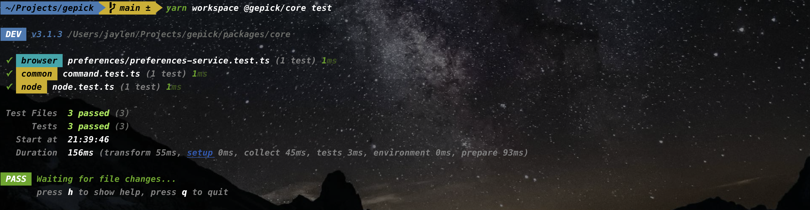

## 测试

为了能够提供代码验证测试，Gepick接入了Vitest框架，并根据实际工程结构设计了`gepick test`命令用来测试你的package。你可以在自己的package中添加一条script命令：`gepick test`，并在package下放置一个`vitest.config.ts`，该配置文件只需要继承自root目录下的`vitest.config.base.ts`即可开启package测试。

由于项目的结构设计是允许一个package同时含有多种环境的代码（browser、common、node），因此我们就需要不同的test runner来测试不同环境的代码。但是`vitest`只是一个测试框架而已，它不会给你区分一个package不同环境的代码调用哪种环境的runner。好在我们发现`vitest`提供了一个叫做`workspace`的概念，这个概念是用在monorepo下多个package，而每个package只有一种环境代码的情况使用的。我们尝试后发现了workaround，让每个monorepo下的package都引入workspace的概念，然后将不同环境的代码文件夹当作workspace来看，这样就能解决一个package不同环境下运行不同runner的效果。
比如拿`@gepick/core`package举例：
运行`yarn workspace @gepick/core test`，效果如下：

如果你希望只是测试一个package下某个环境的代码，那么你可以运行`yarn workspace @gepick/core test -e browser`，效果如下：

以上仅仅需要你往`@gepick/core`包中添加一条`test: gepick test`script，以及提供一个继承自`vitest.config.base.ts`的配置文件`vitest.config.ts`即可。

当然，如果你往root包`@gepick/monorepo`下添加test script `gepick test`，效果就是运行该仓库的所有package的测试。效果如下：
。运行`gepick test -e browser`你还可以只测试所有package下browser环境的代码，效果如下：
