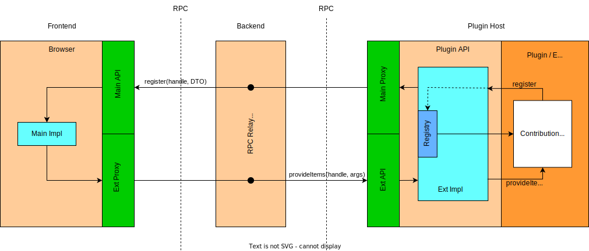

# 插件系统设计

## 各个系统部分

- [ ] 提供插件系统生命周期
  - [ ] 部署插件
  - [ ] 运行插件
  - [ ] 停止插件
  - [ ] 卸载插件
- [ ] 提供插件与内核之间的通信
- [ ] 提供`Plugin API`包给第三方开发者开发自定义插件
- [ ] 提供插件市场给用户选择使用插件

## 插件生命周期

### 部署插件

- 步骤1: 检测plugin存放位置
- 步骤2: 根据plugin存放位置解析plugin
- 步骤3: 根据plugin entries尝试处理每个entry确定plugin类型
- 步骤4: 拿着plugin entries部署plugin

### 运行插件

- 步骤1: 同步已部署的插件列表
  - 步骤1: 获取已经部署的plugins
  - 步骤2: 确定有plugin的话准备plugin运行环境- plugin host进程
  - 步骤3: 获取plugin id数组，如：`[ "<unpublished>.plugin-a@1.53.0", "<unpublished>.plugin-a@1.53.0" ]`
  - 步骤4: 根据plugin id数组获取到plugin数组

- 步骤2: 根据已部署的插件列表将插件逐一启动
  - 步骤0：获取plugin manager代理（只会有1个代理负责所有插件相关启动），通知plugin manager准备plugin api使用环境（Main端和Ext端都初始化）。

    > 为了能够通知plugin manager，前置的步骤就是建立起通信桥梁，即RPC通道，这个在获取plugin manager代理这一步一并实现了。

  - 步骤1: 通知plugin manager注册plugin，监听相关activate events。
    - `registerPlugin`主要逻辑还是将activate event与`loadPlugin`关联。

  - 步骤2: 派发相关event，让监听对应event的plugin激活执行。
    - `activateEvent`主要派发相关event，对应插件如果监听了这些event，那么`loadPlugin`会被执行。

  - 步骤3:`loadPlugin` 正式执行plugin，即调用`startPlugin`，将plugin对应的start方法执行起来。

### 停止插件

### 卸载插件

## Plugin与Core之间的消息传递

由于Plugin是运行在一个隔离的Plugin进程当中的，而Core则运行在其他进程当中。因此设计Plugin API的时候就必须考虑Plugin应该如何与Core通信的问题。在项目当中，我们通过利用RPC技术建立起Plugin与Core之间的通信桥梁，并设计一套`Main-Ext`的通信模式。

如上图，我们将应用结构分成三个部分，分别是`Frontend`、`Backend`、`Plugin Host`，同时也代表着三个不同的进程，RPC就发生在它们之间。Core所在一端称为Main端，而Plugin所在的一端称为Ext端。Plugin API实际上就是Ext端的各种Ext具体实现所暴露的相关接口，第三方开发者使用Plugin API开发他们自己的Plugin来扩展Core，而我们开发Plugin System需要做的就是针对Ext端和Main端做API在各端的通讯实现，然后暴露出Ext端的相关调用作为第三方插件开发者需要用到的Plugin API。通过`Main-Ext`通讯模式，任何一个Plugin如果需要Core的相关信息都可以利用在Plugin侧的Main端代理进行RPC，请求Core侧的Main端本体来完成信息的获取和操纵。反过来，Core如果希望获取Plugin的相关信息，都可以通过本地Ext端的代理进行RPC，请求Ext端本体来完成信息的获取。
综上，Plugin与Core之间的消息传递需要设计RPC作为基础调用方案，然后RPC调用方案为基础进行设计`Main-Ext`通讯模式。

## 参考

- [既然有 HTTP 请求，为什么还要用 RPC 调用？ - 知乎](https://www.zhihu.com/question/41609070)
